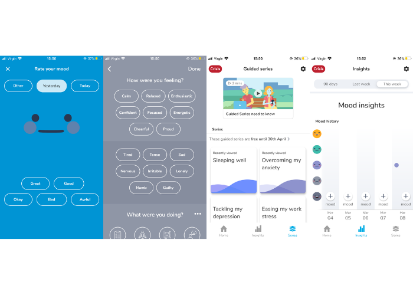
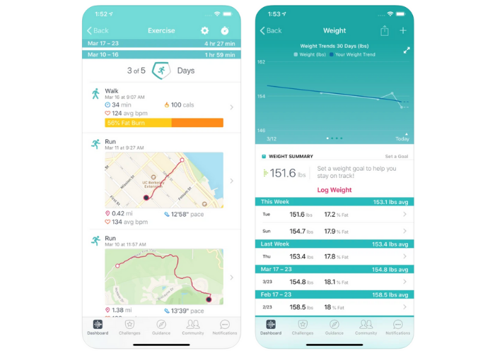
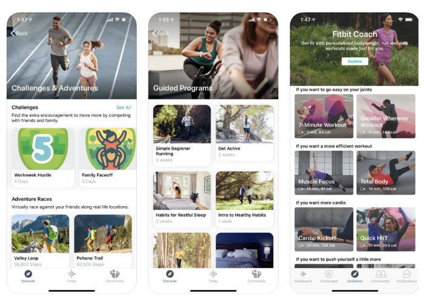

## Related Projects Review

There are 2 phone applications that bore a resemblance to our NudgeMe requirements. 

One is a free mental wellbeing app called *MyPossibleSelf*, available on both iOS and Android. 

### MyPossibleSelf

_Mental health/wellbeing phone app._

It tracks daily mood and allows users to document how they are feeling using tags. 

It also provides ‘series’ on factors that affect wellbeing, such as sleep, anxiety, work stress and depression. 

These series include  

- Quizzes 

- Affirmations for different situations 

- Video guides containing tips. These are free for 1 month. 

- Options to set reminders for themselves 

- Options to track the factors mentioned (sleep, anxiety, exercise...) alongside mood 

- External resources.  

Our review: 

- Setting reminder notifications helps users to remember to use the app to track daily. 

- Daily tracking 4 or 5 things can take up a lot of the user's time. 

- Too many colours and sections can be confusing. It is hard to remember the path to each section. 

- Free services become in-app purchases after a period of time. This is not widely accessible.




The second is a free app available on both iOS and Android that connects to the popular fitness smart-watch, the FitBit.

### FitBit: Health and Fitness
_Steps and health tracker phone app._

Tracks steps, bpm, sleep based on data from FitBit watch. Users can also track weight by logging it manually. 

Provides the following: 

- ‘Challenges’ e.g. certain number of steps or family step competitions
- 'FitBit coach’: exercise videos involving cardio, yoga etc. 
- ‘Guided programs’: courses to encourage more exercise or a change of habits e.g. ‘Habits for restful sleep: a 2 week course’ and ‘Simple Beginner Running: 3 week course’ 

Our review: 

- Only 3 tabs makes it easy to navigate.

- App is free but requires owning a Fitbit watch which ranges from £80-120. 

- They store personally identifiable health data which is unethical and off-putting. 

- Not possible to track different variables on the same graph.

- Only made for physical wellbeing, not made with mental wellbeing in mind.

- Presents exercise as a competition rather than something for yourself. This is not effective for people who just need to be encouraged to move at all. 

- Weight loss tracking can endanger people who suffer from disordered eating.




## Technology Review

### Solutions 

Possible solutions include a web app or a phone app (for iOS and/or for Android).  

We concluded that having a web app would not be very useful. Phone apps are more suitable for a wellbeing and exercise application, as most people carry their phones around all the time. Therefore:  

A phone app can count steps whilst the application is not open (making the step levels much more accurate). Users would be unlikely to keep a web app open on their phone to allow step counter to count steps throughout their week. While having a web app would make NudgeMe accessible through more devices, desktop computers do not tend to contain pedometers or motion sensors so this would not be useful. 

Notifications on a phone app are more likely to be seen and addressed. Users would be unlikely to log their wellbeing into a web app without being prompted. 

### Devices 

Our app can be deployed to both Android and iOS phones, as most people have these devices. As shown in the graph below: <div id="mobile_os_combined-GB-monthly-202002-202102" width="600" height="400" style="width:600px; height: 400px;"></div><!-- You may change the values of width and height above to resize the chart --><p>Source: <a href="https://gs.statcounter.com/os-market-share/mobile/united-kingdom">StatCounter Global Stats - OS Market Share</a></p><script type="text/javascript" src="https://www.statcounter.com/js/fusioncharts.js"></script><script type="text/javascript" src="https://gs.statcounter.com/chart.php?mobile_os_combined-GB-monthly-202002-202102&chartWidth=600"></script> 

We used a Windows and Mac laptop to develop on both and test on each of these platforms.

### Algorithms 

The nudge algorithm sends a Nudge notification if: 

- Step levels have not increased in 48 hours 

- Wellbeing levels have dropped twice in the last 3 weeks. 

These time frames were chosen because they were specified by the client as Must Have requirements. *(link to Moscow?)*

### Programming languages, Frameworks and Libraries 

The _programming languages and frameworks_ that we considered using included: 

- Javascript/React Native for both Android and iOS 

- Kotlin for Android, Swift ior iOS 

- Dart/Flutter for both Android and iOS, which we used.

In our team, two people used Windows laptops and one person had a MacBook so, instead of creating two separate applications for both iOS and Android (for one of which, one person would be entirely responsible for), we thought it would be better to all work on one codebase that could be deployed to both platforms. This is the reason we did not decide to use Kotlin and Swift. 

The other two options were Dart/Flutter and React Native. While both seemed like good options, Flutter seemed suitable for this project, as our team consisted of people with varying experience (some in front-end, some in back-end) and languages (Python, Dart, Kotlin, Swift, React Native).  Additionally, while React Native has a much bigger community of programmers and consequently better online support, Flutter is compiled with a C library which is closer to machine language and therefore has better native performance (1). Lastly, the whole team either wanted to learn Flutter or to gain more experience with Flutter. The language Dart within the Flutter framework therefore seemed to be the most suitable for building NudgeMe. 

The image below is our pubspec.yaml file. This contains the names and versions of all the Flutter libraries that we used, separated into the categories util, data-related and UI. 

```
INSERT SCREENSHOT/CODE FROM PUBSPEC.YAML
```
The most significant _libraries_ we used include the following. 

In Util: 
    
- [Flutter local notifications](https://pub.dev/packages/flutter_local_notifications)

    - Most popular flutter library used to implement push notifications on both platforms (has over 1400 likes).  

- [Pedometer](https://pub.dev/packages/pedometer)

    - We used this package to count the user’s steps as this was the only prominent way of using a pedometer in a flutter app that I could find.  
    - It only provides access to the cumulative steps through a stream.  
    -  At first, to access weekly steps, we used logic from [this blog post](https://blog.maskys.com/implementing-a-daily-step-count-pedometer-in-flutter/) that essentially logs the step count stream once a week, and calculates the weekly steps by negating the count last week from the count this week. However, this did not work on Android devices so we simplified the logic and adapted it for our use. 

*Still need to finish writing about the rest*

- [Permission handler](https://pub.dev/packages/permission_handler)

- [Contacts services](https://pub.dev/packages/contacts_service)/[Flutter SMS](https://pub.dev/packages/flutter_sms)  

- [Sentry](https://pub.dev/packages/sentry)? or we can talk about Sentry elsewhere 

In data-related: 

- [Provider](https://pub.dev/packages/provider)

- [Shared preferences](https://pub.dev/packages/shared_preferences)
    - We chose to use the shared preferences database as it is an extremely popular flutter package for storing data (over 2600 likes) and suited our needs. Data is stored and accessed using keys.

In UI: 

- [Flutter charts](https://pub.dev/packages/charts_flutter)
    - Write about why we used flutter charts instead of [FL chart](https://pub.dev/packages/fl_chart) if there was a particular reason

- [Introduction screen](https://pub.dev/packages/introduction_screen)
    - We chose this package because this introduction screen format seemed suitable for our onboarding process as it was popular, looked nice and seemed simple.
    - Note: we did encounter issues with widgets being cut off on smaller screens, so we [forked the repo](https://github.com/saachipahwa/introduction_screen) and added a scroll bar where this happened . 

- [Highlighter coachmark](https://pub.dev/packages/highlighter_coachmark)
    - These coach marks are the slides in the tutorials that play when users finish the introduction screen and view the main app pages for the first time, and when they press the information button on the wellbeing page. 
    - We chose this package instead of Tutorial Coach Mark, despite this one having more likes, because Highlighter Coach Mark had a simpler look that better suited what we wanted. 

- [QR flutter](https://pub.dev/packages/qr_flutter)

## References 

(1) [Hackr.io: Flutter vs React](https://hackr.io/blog/react-native-vs-flutter)
